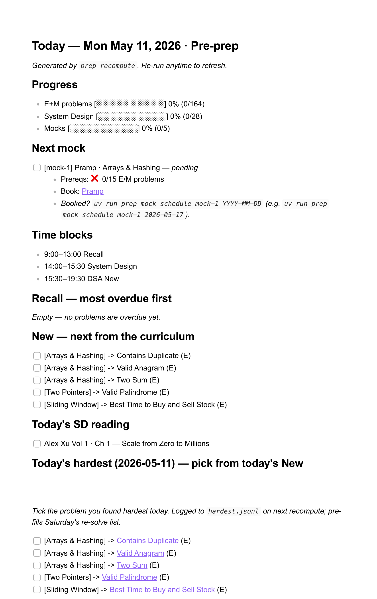

# Interview Prep

<a href="https://www.buymeacoffee.com/rasha_hantash" target="_blank"></a>

> **Tells you what to do _today_ — not what to study this month.**

A local-first interview prep engine for Obsidian. Each morning it regenerates
one file, `today.md`, with the day's recall queue, new problems, system
design reading, and mock status — pulled from a single master curriculum and
your own append-only ledger of completions.

<details>
<summary><b>Preview <code>today.md</code> in Obsidian</b></summary>



</details>

---

## Table of contents

- [What this is](#what-this-is)
- [Is this for you?](#is-this-for-you)
- [Why not just…?](#why-not-just)
- [Quickstart](#quickstart)
- [What `today.md` shows](#what-todaymd-shows)
- [How the engine works](#how-the-engine-works)
- [Daily flow](#daily-flow)
- [Target pace](#target-pace)
- [Curriculum](#curriculum)
- [Phases](#phases)
- [Spaced repetition](#spaced-repetition)
- [Mocks and interviews](#mocks-and-interviews)
- [Files](#files)
- [Design rationale](#design-rationale)
- [Glossary](#glossary)
- [License](#license)

---

## What this is

Most interview prep plans tell you what to study.

This repo tells you what to do **today**.

Each morning, the engine regenerates `today.md` from one master file: `curriculum.md`.

`today.md` answers:

- What should I recall before I forget it?
- What new problems should I solve next?
- What system design chapter should I read?
- Which mocks are unlocked?
- What behavioral work should I drill?
- What did I find hardest this week?

The goal is to remove the daily planning tax.

Open `today.md`, do the work, check boxes, recompute tomorrow.

---

## Is this for you?

**This is for you if:**

- You're prepping for SWE interviews and want one file that tells you what to work on each day
- You're comfortable in Obsidian (or any Markdown editor that supports the Tasks plugin)
- You can run one CLI command per day
- You want spaced repetition that survives missed days without thrashing your plan

**This isn't for you if:**

- You want a hosted web app or mobile UI
- You want video walkthroughs, AI hints, or in-editor solutions — this engine plans the day, it doesn't solve problems for you
- You want a calendar-locked plan that ignores actual completion
- You don't want to use Obsidian or another local Markdown vault

---

## Why not just…?

**Why not Anki?**
Anki handles fact-level recall well — code templates, complexity tables, Python gotchas. It cannot sequence "do these new problems today, but only after recall, and only if your scheduled mock prereqs are met." This engine plans the day; Anki memorizes facts. Both ship together — Anki joins the loop in Phase 8.

**Why not the NeetCode roadmap site?**
Static order, no spaced repetition, no daily snapshot. You'd still need a separate scheduler to decide what to revisit and when.

**Why not LeetCode's built-in scheduler?**
It recommends what to _practice_, not what to _do today_. No mock prereqs, no system design integration, no single daily plan file you can open and start working from.

**Why not a spreadsheet?**
That was the v0. SM-2 scheduling, ledger replay across phases, and prereq-gated mocks are the parts a spreadsheet can't do. The engine is also snapshot-based: ticking a box today doesn't reshuffle today's plan, which a spreadsheet can't enforce.

---

## Quickstart

### 1. Open the repo as an Obsidian vault

Install the Obsidian **Tasks** plugin and enable:

```txt
Set done date on task completion
```

### 2. Install dependencies and seed your workspace

```sh
# Python 3.11+ required
curl -LsSf https://astral.sh/uv/install.sh | sh
uv sync
uv run pytest
uv run prep init       # copies curriculum.template.md → curriculum.md (your file)
uv run prep recompute
```

Open `today.md` — that is your daily plan.

`curriculum.md`, `problems/`, `prep-data/`, and `today.md` are gitignored —
they hold your progress and never leave your machine. The committed source
of truth is `curriculum.template.md`. Re-running `prep init` is a safe
no-op once `curriculum.md` exists; pass `--force` to reseed from the
template (and lose your local ticks).

`prep` is the engine's CLI, exposed by `uv sync` via `pyproject.toml` — no
separate install step.

### 3. Everyday CLI

```sh
uv run prep recompute                         # regenerate today.md
uv run prep preview                           # preview today's plan
uv run prep preview --for weekday             # or: --for sat / --for sun
uv run prep preview --date 2026-05-17         # any specific date

uv run prep mock schedule mock-1 2026-05-17   # schedule a mock
uv run prep mock complete mock-1              # complete a mock (defaults to today)
uv run prep mock list                         # show every mock and its state

uv run prep init --force                      # reseed curriculum.md from the template
uv run pytest                                 # run the engine's test suite
```

### 4. Optional: daily auto-recompute on macOS

The repo ships a LaunchAgent template at `launchd/com.today-dsa.recompute.plist`. Before loading it, open the file and replace the three `__REPLACE_ME__` markers with:

- `__REPLACE_ME_REPO_PATH__` → absolute path to your clone of this repo
- `__REPLACE_ME_UV_BINARY_PATH__` → output of `which uv`
- `__REPLACE_ME_LOG_PATH__` → e.g. `/Users/you/Library/Logs/today-dsa.log`

Then install it:

```sh
cp launchd/com.today-dsa.recompute.plist ~/Library/LaunchAgents/
launchctl load ~/Library/LaunchAgents/com.today-dsa.recompute.plist
```

It runs daily at 8:30 AM. The Mac must be awake at 8:30 — if it sleeps through, run `uv run prep recompute`.

---

## What `today.md` shows

A weekday `today.md` includes:

- Progress bars
- Recall queue
- New DSA problems
- System design reading
- Mock / interview status
- Today's hardest problem
- Maintenance queue at the bottom (only after every E/M is touched 4×)

Saturday adds:

- This week's hardest re-solve block

Sunday removes required work.

You can preview weekday, Saturday, or Sunday layouts without touching state. See the CLI section above.

---

## How the engine works

The engine is snapshot-based.

Each recompute:

1. Reads completed ticks from `today.md`
2. Syncs completions into the append-only ledger
3. Updates mastery state in `curriculum.md`
4. Recomputes due recall items
5. Selects the next new problems
6. Checks which mocks are unlocked
7. Regenerates `today.md`

Run:

```sh
uv run prep recompute
```

The generated `today.md` is frozen for the day.

Checking boxes does not reshuffle the queue until the next recompute.

---

## Daily flow

The core rule:

```txt
Recall before New.
```

Recall is knowledge you already paid for. If you skip it, it decays.

New problems are just deferred scope. They can move to tomorrow.

Default priority:

1. Recall
2. System design
3. New DSA
4. Mocks / real screens
5. Behavioral

Exception:

```txt
If a scheduled mock or interview needs an uncovered pattern, prioritize that pattern for the day.
```

---

## Target pace

The default plan assumes full-time prep:

```txt
9 hours/day
Monday–Saturday
Sundays off
```

At that pace:

- **Day 45:** Easies + Mediums complete; I should feel confident enough to start applying
- **Day 60:** Hards complete; full DSA acquisition cycle done
- **Day 61+:** Recall, mocks, real screens, system design, and behavioral drilling

The engine is not calendar-locked.

If you move slower or faster, phase advancement still comes from completed work, not from the date.

---

## Curriculum

The DSA curriculum is:

```txt
NeetCode 150 + 44 targeted extras = 194 problems
```

The 44 extras fill patterns that NeetCode 150 under-covers or skips.

<details>
<summary>Patterns added by the gap-fillers</summary>

- Segment tree
- Sweep line
- Bitmask DP
- Prefix sum + hashmap
- Cyclic sort
- Difference array
- Binary indexed tree
- Bit trie
- Reservoir sampling
- Additional interval / parsing / tree-hash variants

</details>

Full scope:

- **194 DSA problems**
  - 150 canonical NeetCode 150
  - 44 targeted gap-fillers
- **System design**
  - DDIA Ch. 5–9
  - Alex Xu Vol. 1
  - Alex Xu Vol. 2 Ch. 1–7
- **Mocks**
  - Algo mocks
  - System design mocks
  - Real screens once scheduled
- **Behavioral**
  - STAR-format story drilling

---

## Phases

Progress is phase-based, but advancement is ledger-driven.

You do not manually move phases forward. The engine advances when the required work is done.

<details>
<summary><b>Phases 1–6 — Easy / Medium acquisition (Day 1–45)</b></summary>

Goal:

```txt
Finish all Easy + Medium problems.
```

Target:

```txt
Day 1–45
164 Easy / Medium problems
```

Rules:

- Easies before Mediums within each pattern
- Problems blocked by pattern
- No Hards yet
- Recall every day
- System design every day
- New DSA Monday–Saturday
- Saturday re-solves the hardest problems from the week

Schedule, Monday–Friday:

| Time        | Block         |
| ----------- | ------------- |
| 9:00–13:00  | Recall        |
| 14:00–15:30 | System Design |
| 15:30–19:30 | New DSA       |

On mock days:

| Time        | Block         |
| ----------- | ------------- |
| 9:00–13:00  | Recall        |
| 14:00–16:00 | Mock          |
| 16:00–17:30 | System Design |
| 17:30–19:30 | New DSA       |

Saturday:

| Time        | Block                        |
| ----------- | ---------------------------- |
| 9:00–13:00  | Recall + this week's hardest |
| 14:00–15:30 | System Design                |
| 15:30–19:30 | New DSA                      |

Sunday:

```txt
Off. Light reading is fine, but no required work is scheduled.
```

</details>

<details>
<summary><b>Phase 7 — Hards (Day 45–60)</b></summary>

Goal:

```txt
Finish all Hard problems.
```

Target:

```txt
Day 45–60
30 Hard problems
```

Rules:

- Same daily structure as Phases 1–6
- Pace drops to 2 new Hards/day
- Hard recall gets a 90-minute budget
- Algo mocks ramp up
- Start applying to safety-net companies

Schedule, Monday–Friday:

| Time        | Block         |
| ----------- | ------------- |
| 9:00–13:00  | Recall        |
| 14:00–15:30 | System Design |
| 15:30–19:30 | New Hards     |

On mock days:

| Time        | Block         |
| ----------- | ------------- |
| 9:00–13:00  | Recall        |
| 14:00–16:00 | Mock          |
| 16:00–17:30 | System Design |
| 17:30–19:30 | New Hards     |

Saturday:

| Time        | Block                        |
| ----------- | ---------------------------- |
| 9:00–13:00  | Recall + this week's hardest |
| 14:00–15:30 | System Design                |
| 15:30–19:30 | New Hards                    |

Sunday:

```txt
Off.
```

</details>

<details>
<summary><b>Phase 8 — Post-acquisition</b></summary>

Goal:

```txt
Convert knowledge into interview performance.
```

There are no new DSA problems in Phase 8.

The daily loop becomes:

- Recall
- System design
- Mock interviews
- Real screens
- Behavioral drilling
- Anki for fact-level recall

This is where prep shifts from acquisition to performance.

Schedule, Monday–Friday:

| Time        | Block              |
| ----------- | ------------------ |
| 9:00–13:00  | Recall             |
| 14:00–16:00 | System Design      |
| 16:00–19:00 | Mock / real screen |

Saturday:

| Time        | Block                        |
| ----------- | ---------------------------- |
| 9:00–12:00  | Recall + this week's hardest |
| 12:00–13:00 | System Design                |
| 14:00–17:00 | Behavioral intensive         |

Sunday:

```txt
Off.
```

Anki starts in Phase 8:

```txt
~15 min/day during downtime
```

It handles fact-level recall:

- Code templates
- Pattern cues
- Python gotchas
- Complexity tables

Problem-level recall stays in `today.md`.

</details>

---

## Spaced repetition

The engine uses a simplified SM-2-style ladder.

Each successful solve advances the problem to the next interval:

| Touches | Next due |
| ------- | -------- |
| 1       | +1 day   |
| 2       | +3 days  |
| 3       | +7 days  |
| 4+      | +21 days |

Four touches counts as mastered. Anything past the fourth solve stays on
the 21-day refresh cadence — there's no 60-day "well-learned" bucket
because, for a 45–60 day interview prep, 21 days is the right outer
horizon. Retention past 21 days is the job of the Maintenance section
(see below), not a longer interval.

Example in `curriculum.md`:

```md
- Two Sum (E) · 4/4 (next due 2026-06-25)
  - [x] ✅ 2026-05-11
  - [x] ✅ 2026-05-14
  - [x] ✅ 2026-05-21
  - [x] ✅ 2026-06-04
- 3Sum (M) · 0/4
```

Untouched problems have no sub-bullets. The first tick from `today.md`
unlocks the mastery slots.

### Maintenance — interleaved across patterns

Spacing and interleaving are different ideas. The interval table above
handles **spacing** (when something resurfaces). The Maintenance section
in `today.md` handles **interleaving** (how mastered problems mix).

Maintenance activates the moment every E/M problem in the curriculum has
reached the 4-touch cap. Before that, you'll never see it. Once it
activates:

- It surfaces ~10 mastered E/M problems per day, drawn round-robin across
  patterns (Arrays → Trees → Graphs → Arrays → …), not blocked by
  pattern like the curriculum's natural order.
- Within each pattern, least-recently-touched leads.
- Items appear regardless of whether they're "overdue" — the 21-day
  refresh cadence makes overdue-driven Recall mostly silent once mastery
  is reached. Maintenance fills the gap.
- It's deterministic — same ledger and date produce the same daily set.

Why this matters: research on retrieval practice consistently finds
that _interleaved_ practice beats blocked practice for transfer and
discrimination, but only after the underlying schemas are formed. During
Phases 1–6, Recall stays urgency-ordered (correct for acquisition).
Post-acquisition, Maintenance takes over (correct for retention).

For a 60-day prep starting Day 1, Maintenance activates around **Day 66**
under perfect adherence (every overdue Recall done on time, no skipped
working days). Realistic adherence — a few skipped reviews, mock-day
schedule pressure — pushes it closer to **Day 75**. Either way, well
before any long-run post-interview maintenance phase but past the
acquisition phase. By default, only E/M problems flow through
Maintenance; Hards stay in urgency-ordered Recall.

---

## Mocks and interviews

Mocks are gated by prereqs.

Each mock has a `prereq:` clause in `curriculum.md`.

Examples:

```txt
15 E+M
axu1-1, axu1-2, axu1-3, axu1-5
```

The engine checks prereqs against the ledger and shows whether each mock is:

```txt
pending → bookable → scheduled → completed
```

### Scheduling a mock or interview

Schedule via the CLI (the date format is validated at entry — typos fail fast):

```sh
uv run prep mock schedule mock-1 2026-05-17
```

Mark complete (defaults to today's date):

```sh
uv run prep mock complete mock-1
```

You can also tick the checkbox in `today.md` after the mock — the Obsidian Tasks plugin auto-stamps `✅ DATE` and the next recompute folds it into the curriculum.

List every mock and its current state:

```sh
uv run prep mock list
```

### Mock platforms

Algo mocks:

- **Pramp** — free peer mocks; useful early
- **Interviewing.io** — paid, higher-signal algo mocks; useful later

System design mocks:

- **Hello Interview** — paid system design mocks gated by relevant chapters

---

## Files

Two roles live in this repo: **shared template** (committed, identical for
everyone) and **your personal state** (gitignored, lives only on your
machine). The split keeps your ticks and solutions from leaking into PRs.

| File                                    | Role     | What it does                                                                          |
| --------------------------------------- | -------- | ------------------------------------------------------------------------------------- |
| `curriculum.template.md`                | template | Pristine master list of problems + SD chapters + mocks + behavioral; never has state. |
| `curriculum.md`                         | personal | Your working copy — `[x]` ticks, ✅ stamps, 📅 schedules. Seeded by `prep init`.      |
| `today.md`                              | personal | Generated daily plan. Regenerated on every `prep recompute`.                          |
| `prep-data/completions.jsonl`           | personal | Append-only DSA completion ledger.                                                    |
| `prep-data/hardest.jsonl`               | personal | Append-only hardest-problem ledger.                                                   |
| `problems/<pattern>/<diff>-<n>.py`      | personal | Your solution files. The directory is gitignored except for `problems/company/`.      |
| `problems/company/*.md`                 | template | Company-question prompts referenced by the curriculum.                                |
| `recall_engine.py`                      | template | SM-2-lite recall engine.                                                              |
| `tests/test_recall_engine.py`           | template | Narrative tests and engine spec.                                                      |
| `launchd/com.today-dsa.recompute.plist` | template | macOS daily recompute LaunchAgent (edit the three `__REPLACE_ME__` markers first).    |
| `patterns/*.md`                         | template | Pattern notes and per-problem mistakes.                                               |
| `python-gotchas.md`                     | template | Python traps found during prep.                                                       |
| `random-problems.md`                    | template | Extra unscheduled practice problems.                                                  |
| `anki/`                                 | template | Fact-level recall decks.                                                              |
| `plans/`                                | template | Refactor and implementation plans.                                                    |
| `scripts/`                              | template | Sandbox + verification scripts for the engine (Maintenance trigger, Hards scope).     |

---

## Design rationale

### Why ledger-driven?

Calendar plans break when life happens.

This engine advances based on completed work, not dates.

If you miss a day, the next recompute adapts.

### Why Recall before New?

Recall protects prior work from decay.

New problems can wait.

The rule is:

```txt
Protect memory first. Add scope second.
```

### Why blocked acquisition and spaced recall?

First exposure works best when the pattern is blocked.

Retention works best when recall is spaced.

So the engine separates the two:

```txt
Acquire blocked.
Retain spaced.
```

### Why Anki only in Phase 8?

During Phases 1–7, first exposure already saturates working memory.

In Phase 8, acquisition is done, so Anki joins the loop for fact-level recall.

---

## Glossary

**Touch**  
One successful solve or re-solve event.

**Recall**  
Previously solved problems that are due again.

**New**  
Never-touched problems selected from the current phase.

**Phase**  
A curriculum stage. Phases 1–6 are Easy/Medium acquisition, Phase 7 is Hards, Phase 8 is post-acquisition.

**SM-2**  
The spaced repetition algorithm family this engine borrows from. The full SM-2 grades each review on a 0–5 scale and computes an "ease factor"; this engine uses a fixed interval ladder (1 / 3 / 7 / 21 days) keyed only on touch count — simpler, deterministic, and well-suited to a 45–60 day prep horizon.

**Blocked practice**  
Doing many problems of the same pattern in a row. Best for first acquisition.

**Interleaved practice**  
Rotating across patterns within a session. Best for retention, transfer, and discrimination — but only after schemas are formed.

**Snapshot mode**  
The daily queue is frozen at recompute time. Ticks affect tomorrow's plan, not today's ordering.

**Mock prereq**  
A condition that must be satisfied before a mock becomes bookable.

**Hardest flag**  
A daily checkbox for the hardest problem of the day. Saturday uses these to build the weekly re-solve block.

---

## License

MIT.
