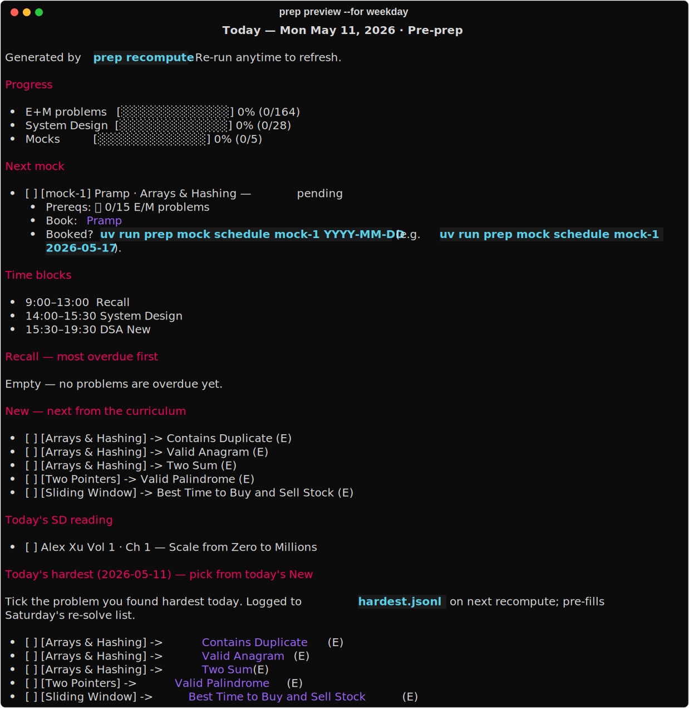

# Interview Prep

<a href="https://www.buymeacoffee.com/rasha_hantash" target="_blank"></a>

A local-first interview prep engine for Obsidian.

It combines:

- **NeetCode 150 + 44 gap-filler problems**
- **SM-2-style spaced repetition** for problem recall
- **Generated daily Markdown plans** in `today.md`
- **System design, mocks, and behavioral prep**
- **Ledger-driven progress** instead of calendar-driven planning

Built for full-time prep, but adaptive to actual completion.

---

## What this is

Most interview prep plans tell you what to study.

This repo tells you what to do **today**.

Each morning, the engine regenerates `today.md` from one master file: `curriculum.md`.

`today.md` answers:

- What should I recall before I forget it?
- What new problems should I solve next?
- What system design chapter should I read?
- Which mocks are unlocked?
- What behavioral work should I drill?
- What did I find hardest this week?

The goal is to remove the daily planning tax.

Open `today.md`, do the work, check boxes, recompute tomorrow.

---

## Curriculum

The DSA curriculum is:

```txt
NeetCode 150 + 44 targeted extras = 194 problems
```

The 44 extras fill patterns that NeetCode 150 under-covers or skips, including:

- Segment tree
- Sweep line
- Bitmask DP
- Prefix sum + hashmap
- Cyclic sort
- Difference array
- Binary indexed tree
- Bit trie
- Reservoir sampling
- Additional interval / parsing / tree-hash variants

Full scope:

- **194 DSA problems**
  - 150 canonical NeetCode 150
  - 44 targeted gap-fillers
- **System design**
  - DDIA Ch. 5–9
  - Alex Xu Vol. 1
  - Alex Xu Vol. 2 Ch. 1–7
- **Mocks**
  - Algo mocks
  - System design mocks
  - Real screens once scheduled
- **Behavioral**
  - STAR-format story drilling

---

## Target pace

The default plan assumes full-time prep:

```txt
9 hours/day
Monday–Saturday
Sundays off
```

At that pace:

- **Day 45:** Easies + Mediums complete; I should feel confident enough to start applying
- **Day 60:** Hards complete; full DSA acquisition cycle done
- **Day 61+:** Recall, mocks, real screens, system design, and behavioral drilling

The engine is not calendar-locked.

If you move slower or faster, phase advancement still comes from completed work, not from the date.

---

## Daily flow

The core rule:

```txt
Recall before New.
```

Recall is knowledge you already paid for. If you skip it, it decays.

New problems are just deferred scope. They can move to tomorrow.

Default priority:

1. Recall
2. System design
3. New DSA
4. Mocks / real screens
5. Behavioral

Exception:

```txt
If a scheduled mock or interview needs an uncovered pattern, prioritize that pattern for the day.
```

---

## How the engine works

The engine is snapshot-based.

Each recompute:

1. Reads completed ticks from `today.md`
2. Syncs completions into the append-only ledger
3. Updates mastery state in `curriculum.md`
4. Recomputes due recall items
5. Selects the next new problems
6. Checks which mocks are unlocked
7. Regenerates `today.md`

Run:

```sh
uv run prep recompute
```

The generated `today.md` is frozen for the day.

Checking boxes does not reshuffle the queue until the next recompute.

---

## What `today.md` shows

A weekday `today.md` includes:

- Progress bars
- Recall queue
- New DSA problems
- System design reading
- Mock / interview status
- Today's hardest problem

Saturday adds:

- This week's hardest re-solve block

Sunday removes required work.

You can preview weekday, Saturday, or Sunday layouts without touching state. See the CLI section below.

Example:



---

## Phases

Progress is phase-based, but advancement is ledger-driven.

You do not manually move phases forward. The engine advances when the required work is done.

---

### Phases 1–6: Easy / Medium acquisition

Goal:

```txt
Finish all Easy + Medium problems.
```

Target:

```txt
Day 1–45
164 Easy / Medium problems
```

Rules:

- Easies before Mediums within each pattern
- Problems blocked by pattern
- No Hards yet
- Recall every day
- System design every day
- New DSA Monday–Saturday
- Saturday re-solves the hardest problems from the week

Schedule, Monday–Friday:

| Time        | Block         |
| ----------- | ------------- |
| 9:00–13:00  | Recall        |
| 14:00–15:30 | System Design |
| 15:30–19:30 | New DSA       |

On mock days:

| Time        | Block         |
| ----------- | ------------- |
| 9:00–13:00  | Recall        |
| 14:00–16:00 | Mock          |
| 16:00–17:30 | System Design |
| 17:30–19:30 | New DSA       |

Saturday:

| Time        | Block                        |
| ----------- | ---------------------------- |
| 9:00–13:00  | Recall + this week's hardest |
| 14:00–15:30 | System Design                |
| 15:30–19:30 | New DSA                      |

Sunday:

```txt
Off. Light reading is fine, but no required work is scheduled.
```

---

### Phase 7: Hards

Goal:

```txt
Finish all Hard problems.
```

Target:

```txt
Day 45–60
30 Hard problems
```

Rules:

- Same daily structure as Phases 1–6
- Pace drops to 2 new Hards/day
- Hard recall gets a 90-minute budget
- Algo mocks ramp up
- Start applying to safety-net companies

Schedule, Monday–Friday:

| Time        | Block         |
| ----------- | ------------- |
| 9:00–13:00  | Recall        |
| 14:00–15:30 | System Design |
| 15:30–19:30 | New Hards     |

On mock days:

| Time        | Block         |
| ----------- | ------------- |
| 9:00–13:00  | Recall        |
| 14:00–16:00 | Mock          |
| 16:00–17:30 | System Design |
| 17:30–19:30 | New Hards     |

Saturday:

| Time        | Block                        |
| ----------- | ---------------------------- |
| 9:00–13:00  | Recall + this week's hardest |
| 14:00–15:30 | System Design                |
| 15:30–19:30 | New Hards                    |

Sunday:

```txt
Off.
```

---

### Phase 8: Post-acquisition

Goal:

```txt
Convert knowledge into interview performance.
```

There are no new DSA problems in Phase 8.

The daily loop becomes:

- Recall
- System design
- Mock interviews
- Real screens
- Behavioral drilling
- Anki for fact-level recall

This is where prep shifts from acquisition to performance.

Schedule, Monday–Friday:

| Time        | Block              |
| ----------- | ------------------ |
| 9:00–13:00  | Recall             |
| 14:00–16:00 | System Design      |
| 16:00–19:00 | Mock / real screen |

Saturday:

| Time        | Block                        |
| ----------- | ---------------------------- |
| 9:00–12:00  | Recall + this week's hardest |
| 12:00–13:00 | System Design                |
| 14:00–17:00 | Behavioral intensive         |

Sunday:

```txt
Off.
```

Anki starts in Phase 8:

```txt
~15 min/day during downtime
```

It handles fact-level recall:

- Code templates
- Pattern cues
- Python gotchas
- Complexity tables

Problem-level recall stays in `today.md`.

---

## Spaced repetition

The engine uses a simplified SM-2-style ladder.

Each successful solve advances the problem to the next interval:

| Touches | Next due |
| ------- | -------- |
| 1       | +1 day   |
| 2       | +3 days  |
| 3       | +7 days  |
| 4       | +21 days |
| 5+      | +60 days |

Example in `curriculum.md`:

```md
- Two Sum (E) · 4/5 (next due 2026-06-25)
  - [x] ✅ 2026-05-11
  - [x] ✅ 2026-05-14
  - [x] ✅ 2026-05-21
  - [x] ✅ 2026-06-04
  - [ ]
- 3Sum (M) · 0/5
```

Untouched problems have no sub-bullets.

The first tick from `today.md` unlocks the mastery slots.

---

## Mocks and interviews

Mocks are gated by prereqs.

Each mock has a `prereq:` clause in `curriculum.md`.

Examples:

```txt
15 E+M
axu1-1, axu1-2, axu1-3, axu1-5
```

The engine checks prereqs against the ledger and shows whether each mock is:

```txt
pending → bookable → scheduled → completed
```

### Scheduling a mock or interview

Schedule via the CLI (the date format is validated at entry — typos fail fast):

```sh
uv run prep mock schedule mock-1 2026-05-17
```

Mark complete (defaults to today's date):

```sh
uv run prep mock complete mock-1
```

You can also tick the checkbox in `today.md` after the mock — the Obsidian Tasks plugin auto-stamps `✅ DATE` and the next recompute folds it into the curriculum.

List every mock and its current state:

```sh
uv run prep mock list
```

### Mock platforms

Algo mocks:

- **Pramp** — free peer mocks; useful early
- **Interviewing.io** — paid, higher-signal algo mocks; useful later

System design mocks:

- **Hello Interview** — paid system design mocks gated by relevant chapters

---

## Quickstart

Open this repo as an Obsidian vault.

Install the Obsidian **Tasks** plugin.

Enable:

```txt
Set done date on task completion
```

Install dependencies:

```sh
# Python 3.11+ required
curl -LsSf https://astral.sh/uv/install.sh | sh
uv sync
uv run pytest
uv run prep recompute
```

Open:

```txt
today.md
```

That is your daily plan.

---

## Optional: daily auto-recompute on macOS

Install the LaunchAgent:

```sh
cp launchd/com.rasha.recall-engine.plist ~/Library/LaunchAgents/
launchctl load ~/Library/LaunchAgents/com.rasha.recall-engine.plist
```

It runs daily at 8:30 AM.

Logs:

```txt
~/Library/Logs/recall-engine.log
```

The Mac must be awake at 8:30. If it sleeps through, run:

```sh
uv run prep recompute
```

---

## CLI

Recompute today:

```sh
uv run prep recompute
```

Preview a day:

```sh
uv run prep preview
uv run prep preview --for weekday
uv run prep preview --for sat
uv run prep preview --for sun
uv run prep preview --date 2026-05-17
```

Schedule, complete, and list mocks:

```sh
uv run prep mock schedule mock-1 2026-05-17
uv run prep mock complete mock-1
uv run prep mock list
```

Run tests:

```sh
uv run pytest
```

---

## Files

| File                                    | What it does                                                   |
| --------------------------------------- | -------------------------------------------------------------- |
| `curriculum.md`                         | Master file for DSA, system design, mocks, and behavioral prep |
| `today.md`                              | Generated daily plan                                           |
| `prep-data/completions.jsonl`           | Append-only DSA completion ledger                              |
| `prep-data/hardest.jsonl`               | Append-only hardest-problem ledger                             |
| `recall_engine.py`                      | SM-2-lite recall engine                                        |
| `tests/test_recall_engine.py`           | Narrative tests and engine spec                                |
| `launchd/com.rasha.recall-engine.plist` | macOS daily recompute LaunchAgent                              |
| `patterns/*.md`                         | Pattern notes and per-problem mistakes                         |
| `problems/<pattern>/<diff>-<n>.py`      | Solution files                                                 |
| `python-gotchas.md`                     | Python traps found during prep                                 |
| `random-problems.md`                    | Extra unscheduled practice problems                            |
| `anki/`                                 | Fact-level recall decks                                        |
| `plans/`                                | Refactor and implementation plans                              |

---

## Design rationale

### Why ledger-driven?

Calendar plans break when life happens.

This engine advances based on completed work, not dates.

If you miss a day, the next recompute adapts.

### Why Recall before New?

Recall protects prior work from decay.

New problems can wait.

The rule is:

```txt
Protect memory first. Add scope second.
```

### Why blocked acquisition and spaced recall?

First exposure works best when the pattern is blocked.

Retention works best when recall is spaced.

So the engine separates the two:

```txt
Acquire blocked.
Retain spaced.
```

### Why Anki only in Phase 8?

During Phases 1–7, first exposure already saturates working memory.

In Phase 8, acquisition is done, so Anki joins the loop for fact-level recall.

---

## Glossary

**Touch**  
One successful solve or re-solve event.

**Recall**  
Previously solved problems that are due again.

**New**  
Never-touched problems selected from the current phase.

**Phase**  
A curriculum stage. Phases 1–6 are Easy/Medium acquisition, Phase 7 is Hards, Phase 8 is post-acquisition.

**Snapshot mode**  
The daily queue is frozen at recompute time. Ticks affect tomorrow's plan, not today's ordering.

**Mock prereq**  
A condition that must be satisfied before a mock becomes bookable.

**Hardest flag**  
A daily checkbox for the hardest problem of the day. Saturday uses these to build the weekly re-solve block.

---

## License

MIT.
